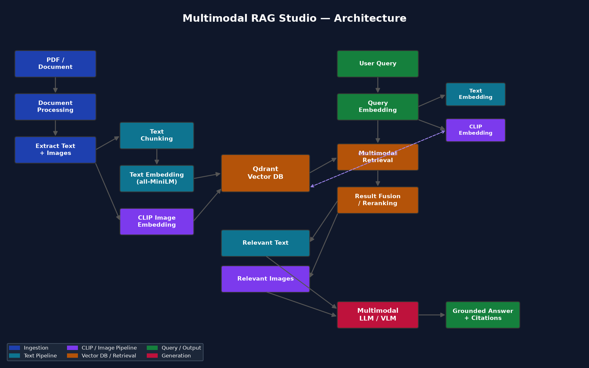

# Multimodal RAG Studio — CLIP-Powered Multimodal Document QA

A production-style, end-to-end **Multimodal Retrieval-Augmented Generation** application. Upload PDFs containing text, figures, diagrams, charts, and tables — then ask questions using **text**, **images**, or **text + image** together. The system retrieves relevant text *and* visual evidence using **CLIP cross-modal embeddings** and generates grounded, cited answers with a vision-language model.



---

## Table of Contents

- [Overview](#overview)
- [Why CLIP + a Separate Text Embedding Model](#why-clip--a-separate-text-embedding-model)
- [Architecture](#architecture)
- [Features](#features)
- [Technology Stack](#technology-stack)
- [Quick Start (Docker)](#quick-start-docker)
- [Local Setup (without Docker)](#local-setup-without-docker)
- [Model Setup](#model-setup)
- [Environment Variables](#environment-variables)
- [PDF Ingestion Workflow](#pdf-ingestion-workflow)
- [Retrieval Workflow](#retrieval-workflow)
- [Multimodal Query Workflow](#multimodal-query-workflow)
- [API Documentation](#api-documentation)
- [Testing](#testing)
- [Project Structure](#project-structure)
- [Limitations](#limitations)
- [Future Improvements](#future-improvements)

---

## Overview

### Problem Statement

Traditional RAG systems index only text. But real documents — research papers, technical reports, manuals — encode critical information in **figures, diagrams, and charts** that text-only retrieval misses. A question like *"What architecture does the paper propose?"* is often best answered by a **figure**, not a paragraph.

### Solution

Multimodal RAG Studio indexes **both** textual and visual content into a vector database using two complementary embedding strategies:

1. **A dedicated text embedding model** (`all-MiniLM-L6-v2`) for long document chunks — optimized for semantic textual similarity.
2. **CLIP** (`clip-ViT-B-32`) for **cross-modal** retrieval — embedding images and short text into a *shared* vector space so a text query can find a relevant figure (and an image query can find related text) even when no words overlap.

At query time, the system fuses text and image evidence, then passes everything to a **vision-language model** (e.g. LLaVA via Ollama) to produce a grounded answer with citations.

---

## Why CLIP + a Separate Text Embedding Model

| Concern | Text Embedding Model | CLIP |
|---|---|---|
| **Long document chunks** (paragraphs) | ✅ Excellent | ❌ Weak — CLIP's text encoder is trained on short image captions, not paragraphs |
| **Short cross-modal queries** | ❌ Text-only | ✅ Shared space: text ↔ image |
| **Image → image similarity** | ❌ No image support | ✅ Yes |
| **Text → image retrieval** | ❌ No | ✅ Yes |

**The design:** long PDF text chunks are embedded with the dedicated text model for high-quality textual retrieval. CLIP handles all *cross-modal* work — embedding query images, short query text, and document images into one shared space. This gives the best of both worlds.

---

## Architecture

```
┌─────────────────────┐
│      PDF / Data     │
└──────────┬──────────┘
           │
           ▼
┌─────────────────────┐
│ Document Processing │  (PyMuPDF: text by page + embedded images)
└──────────┬──────────┘
           │
    ┌──────┴──────┐
    ▼             ▼
Extract Text   Extract Images
    │             │
    ▼             ▼
Text Chunking    CLIP
    │             │
    ▼             ▼
Text Embedding  Image Embeddings
    │             │
    └──────┬──────┘
           ▼
     Qdrant Vector DB
     (text + image collections)
           │
           ▼
       USER QUERY
    ┌──────┼──────┐
    ▼      ▼      ▼
  Text  Image  Text+Image
    │      │      │
    ▼      ▼      ▼
Text Embed  CLIP   CLIP (blend)
    │      │      │
    └──────┼──────┘
           ▼
  Multimodal Retrieval
           │
           ▼
  Result Fusion / Ranking
   final = text_score·w_t + clip_score·w_i
           │
    ┌──────┴──────┐
    ▼             ▼
Relevant Text  Relevant Images
    │             │
    └──────┬──────┘
           ▼
  Multimodal LLM / VLM
           │
           ▼
  Grounded Answer + Citations
```

---

## Features

### Document Ingestion
- PDF upload with drag-and-drop
- Page-by-page text extraction (PyMuPDF)
- Embedded image extraction with deduplication
- Automatic **figure caption association** ("Figure 1: ..." → image)
- Text chunking with configurable size + overlap
- Rich metadata preservation (document, page, chunk id, source)
- Duplicate detection by content hash
- Re-index and delete support

### Multimodal Retrieval
- **Text-only** queries → text chunks + CLIP-matched images
- **Image-only** queries → visually similar images + related text
- **Text + image** queries → fused cross-modal retrieval
- Configurable result fusion weights
- Score thresholding and top-k control

### Generation
- Provider abstraction: **Ollama** (local VLM) or **OpenAI-compatible** (OpenRouter, etc.)
- Multimodal prompt with retrieved text + images
- Grounded-answer system prompt (no fabrication, cite sources, admit insufficient evidence)
- Bounded conversation history for follow-up questions

### Transparency
- Per-answer **retrieval evidence panel** with scores
- Image thumbnails with lightbox preview
- Pipeline visualization (query type → retrieval → fusion → generation)
- Structured logging with request IDs and timing

### UI
- Polished dark/light mode dashboard
- Chat, Documents, and Settings pages
- Toast notifications, skeletons, empty/error states
- Fully responsive

---

## Technology Stack

| Layer | Technology |
|---|---|
| Backend | Python 3.11+, FastAPI, Pydantic, Uvicorn |
| PDF Processing | PyMuPDF (fitz), Pillow |
| Text Embeddings | sentence-transformers (`all-MiniLM-L6-v2`) |
| Cross-modal Embeddings | sentence-transformers CLIP (`clip-ViT-B-32`) |
| Vector Database | Qdrant (local embedded or Docker) |
| LLM/VLM | Ollama (LLaVA) or OpenAI-compatible API |
| Frontend | React 18, TypeScript, Vite, Tailwind CSS |
| State | Zustand |
| Icons | Lucide React |

---

## Quick Start (Docker)

**Prerequisites:** Docker + Docker Compose

```bash
# 1. Clone and enter the project
git clone https://github.com/omarEssam-11/multimodal-rag-studio.git
cd multimodal-rag-studio

# 2. Configure environment
cp backend/.env.example backend/.env
# edit backend/.env — set LLM_PROVIDER, models, etc.

# 3. Start all services
docker compose up --build

# 4. Open the app
# Frontend:  http://localhost:3000
# API docs:  http://localhost:8000/docs
```

This starts **Qdrant**, the **FastAPI backend**, and the **React frontend** (served via nginx).

---

## Local Setup (without Docker)

**Prerequisites:** Python 3.11+, Node.js 18+, (optional) Ollama

### 1. Backend

```bash
cd backend

# Create a virtual environment
python -m venv venv
source venv/bin/activate        # Windows: venv\Scripts\activate

# Install dependencies
pip install -r requirements.txt

# Configure environment
cp .env.example .env
# edit .env — defaults work for local embedded Qdrant + Ollama

# Run the API (Qdrant runs in embedded local mode — no Docker needed)
uvicorn app.main:app --reload --port 8000
```

The API will be at `http://localhost:8000` (interactive docs at `/docs`).

### 2. Frontend

```bash
cd frontend
npm install
npm run dev
```

The dev server starts at `http://localhost:5173` and proxies `/api` to the backend.

### 3. (Optional) Ollama for local VLM

```bash
# Install Ollama from https://ollama.com, then:
ollama pull llava:7b
ollama serve
```

Set in `.env`:
```
LLM_PROVIDER=ollama
LLM_MODEL=llava:7b
OLLAMA_BASE_URL=http://localhost:11434
```

---

## Model Setup

### Embedding models (auto-downloaded on first use)
- **Text:** `sentence-transformers/all-MiniLM-L6-v2` (384-dim)
- **CLIP:** `sentence-transformers/clip-ViT-B-32` (512-dim)

Both download from HuggingFace on first run and are cached locally. No manual setup needed (internet required on first run).

### LLM/VLM
- **Ollama (default, local):** `ollama pull llava:7b` → set `LLM_PROVIDER=ollama`
- **OpenAI-compatible (e.g. OpenRouter):** set `LLM_PROVIDER=openai_compatible`, `OPENAI_API_KEY=...`, `OPENAI_BASE_URL=...`, `OPENAI_MODEL=...`

---

## Environment Variables

All configuration lives in `backend/.env`. Copy from `.env.example`.

| Variable | Default | Description |
|---|---|---|
| `QDRANT_MODE` | `local` | `local` (embedded) or `remote` (Docker/server) |
| `QDRANT_PATH` | `../data/qdrant_storage` | Embedded Qdrant storage path |
| `QDRANT_HOST` / `QDRANT_PORT` | `localhost` / `6333` | Remote Qdrant connection |
| `TEXT_EMBEDDING_MODEL` | `sentence-transformers/all-MiniLM-L6-v2` | Text chunk embedding model |
| `CLIP_MODEL` | `sentence-transformers/clip-ViT-B-32` | CLIP cross-modal model |
| `CHUNK_SIZE` / `CHUNK_OVERLAP` | `500` / `80` | Text chunking params |
| `TOP_K_TEXT` / `TOP_K_IMAGES` | `5` / `5` | Retrieval top-k |
| `TEXT_RETRIEVAL_WEIGHT` / `IMAGE_RETRIEVAL_WEIGHT` | `0.6` / `0.4` | Fusion weights |
| `LLM_PROVIDER` | `ollama` | `ollama` or `openai_compatible` |
| `LLM_MODEL` | `llava:7b` | Ollama model name |
| `OPENAI_API_KEY` / `OPENAI_BASE_URL` / `OPENAI_MODEL` | — | OpenAI-compatible provider |
| `MAX_UPLOAD_MB` | `50` | Max PDF upload size |
| `MAX_HISTORY_MESSAGES` | `10` | Bounded chat history |

---

## PDF Ingestion Workflow

```
Upload PDF
  → validate (type, size, magic bytes)
  → generate document ID + content hash (dedup)
  → save original file
  → extract text page-by-page (PyMuPDF)
  → chunk text (size + overlap, paragraph-aware)
  → extract embedded images (dedup, min-size filter)
  → associate figure captions with images
  → embed text chunks (text model) → Qdrant text collection
  → embed images (CLIP) → Qdrant image collection
  → persist metadata (JSON store)
  → mark document as indexed
```

---

## Retrieval Workflow

```
Query (text / image / text+image)
  → embed query:
      text → text model (text collection)  +  CLIP text encoder (image collection)
      image → CLIP image encoder (image collection)
      text+image → blend CLIP text + image vectors
  → search Qdrant (text + image collections)
  → fuse results:  score = text_score·w_t + clip_score·w_i
  → apply score threshold + top-k
  → return structured evidence
```

---

## Multimodal Query Workflow

```
User asks "What architecture does the paper propose?" (+ optional image)
  → retrieve top-k text chunks (text model)
  → retrieve top-k images (CLIP cross-modal)
  → fuse + rank
  → build multimodal context (text passages + images)
  → send to VLM with grounded-answer system prompt
  → VLM returns answer citing [document — page N]
  → UI shows answer + evidence panel + pipeline
```

---

## API Documentation

Interactive docs at `http://localhost:8000/docs` (Swagger UI).

| Method | Endpoint | Description |
|---|---|---|
| `POST` | `/api/documents/upload` | Upload + index a PDF (multipart) |
| `GET` | `/api/documents` | List all documents |
| `GET` | `/api/documents/{id}` | Get one document |
| `GET` | `/api/documents/{id}/status` | Get indexing status |
| `POST` | `/api/documents/{id}/index` | Re-index a document |
| `DELETE` | `/api/documents/{id}` | Delete a document |
| `POST` | `/api/chat` | Ask a question (text and/or image) |
| `POST` | `/api/retrieve` | Retrieve evidence only (no generation) |
| `GET` | `/api/health` | System health |
| `GET` | `/api/config` | Current configuration |
| `GET` | `/api/images/{image_id}` | Serve an extracted image |

### Example: text + image query

```bash
curl -X POST http://localhost:8000/api/chat \
  -F "message=Explain this architecture" \
  -F "image=@/path/to/diagram.png"
```

---

## Testing

```bash
cd backend

# Fast tests (no model downloads)
pytest

# Full tests (downloads embedding/CLIP models — slow, ~minutes)
RUN_SLOW_TESTS=1 pytest
```

Tests cover: PDF extraction, chunking, CLIP/text embeddings, Qdrant operations, retrieval, fusion, API endpoints, security, and error handling.

---

## Project Structure

```
multimodal-rag-studio/
├── backend/
│   ├── app/
│   │   ├── main.py              # FastAPI entry point
│   │   ├── config.py            # Env-based settings
│   │   ├── api/                 # Route handlers
│   │   │   ├── documents.py
│   │   │   ├── chat.py
│   │   │   ├── retrieve.py
│   │   │   └── system.py
│   │   ├── schemas/             # Pydantic models
│   │   ├── services/            # Core logic
│   │   │   ├── pdf_processor.py
│   │   │   ├── text_chunker.py
│   │   │   ├── embedding_service.py
│   │   │   ├── clip_service.py
│   │   │   ├── vector_store.py
│   │   │   ├── retriever.py
│   │   │   ├── llm_service.py
│   │   │   ├── rag_service.py
│   │   │   ├── ingestion_service.py
│   │   │   └── conversation.py
│   │   ├── utils/               # logger, security
│   │   └── tests/               # pytest suite
│   ├── requirements.txt
│   ├── .env.example
│   └── Dockerfile
├── frontend/
│   ├── src/
│   │   ├── components/          # Sidebar, ChatMessage, EvidencePanel, ...
│   │   ├── pages/               # ChatPage, DocumentsPage, SettingsPage
│   │   ├── services/api.ts      # API client
│   │   ├── store/useStore.ts    # Zustand store
│   │   └── types/
│   ├── package.json
│   └── Dockerfile
├── data/                        # uploads, extracted images, qdrant storage
├── docker-compose.yml
└── README.md
```

---

## Limitations

- **CLIP text encoder** is designed for short captions, not long paragraphs — hence the separate text model for chunks.
- **Local Qdrant** (embedded mode) is single-node and not suitable for high-concurrency production; use the Docker/remote mode for that.
- **Conversation history** is in-memory (not persisted across restarts).
- **Figure caption association** uses heuristic regex patterns; complex layouts may not be captured.
- **VLM quality** depends on the model — `llava:7b` is a good local default but larger models give better answers.

---

## Future Improvements

- [ ] Hybrid search (BM25 + vector) for text retrieval
- [ ] Multi-document cross-referencing in answers
- [ ] Streaming responses (SSE) for faster perceived latency
- [ ] Persistent conversation history (database-backed)
- [ ] User authentication and multi-tenancy
- [ ] Support for additional file types (DOCX, PPTX, HTML)
- [ ] Advanced table extraction and indexing
- [ ] Evaluation harness (retrieval accuracy, answer groundedness)
- [ ] GPU acceleration for embeddings
- [ ] Re-ranking with a cross-encoder

---

## License

MIT
